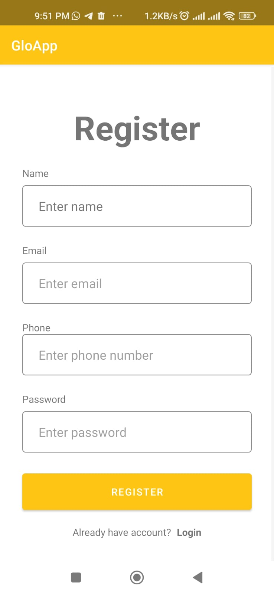
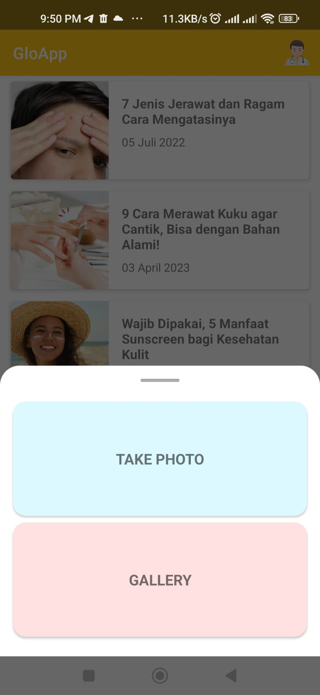

# GloApp 

GloApp GitHub Repositories of Bangkit Academy 2023 Capstone Project Team C23-PS245 from 3 learning path, Machine Learning, Cloud Computing, and Mobile Development

# About The Project

Approximately 1.9 million people in Indonesia have experienced skin problems. However, there are several individuals who are unable to access healthcare due to time constraints and mobility limitations. Therefore, GloApp is here to assist the community in early diagnosis of skin diseases, wherever and whenever they are. GloApp will provide explanations about the experienced skin conditions, the causes of the diseases, and how to manage them. Additionally, we also offer a platform for online consultations with doctors for further explanations and treatment.

	 &nbsp; &nbsp; &nbsp;
	 &nbsp; &nbsp; &nbsp;
	

# Team Members

## Team ID: C23-PS245
 

| Name                  | Student ID | Path                |
| --------------------- | ---------- | ------------------- |
| Adinda Nur Halisyah   | M166DSY1747| Machine Learning    |
| Nurfian Dwi Noviani   | M166DSY2185| Machine Learning    |
| Nicolas Raja O. M.    | C130DSX0663| Cloud Computing     |
| Sahat Parulian	      | C309DSX2689| Cloud Computing     |
| Muhamad Fiqih Ikhsan  | A166DSX2281| Mobile Development  |
| Joseph Julio N.       | A333DSX1186| Mobile Development  |

 

# Resource

In our project is divided into four branches, namely:

  1. [main](https://github.com/CookiePie-cell/gloapp.git)
  2. [android-development](https://github.com/CookiePie-cell/gloapp/tree/Mobile-Development)
  3. [cloud-computing](https://github.com/CookiePie-cell/gloapp/tree/Cloud-Computing)
  4. [machine-learning](https://github.com/CookiePie-cell/gloapp/tree/Machine-Learning)

# Getting Started

- **Prerequisites**

  1.	Android
  2.	Internet connection
  3.	Camera/photos

- **Installation**

  1.	Download the application
  2.	Install the application

- **Register**

  1.	Open GloApp application
  2.	Register your email address

# Usage

- How to identify skin diseases:

    1. Log in to your account.
    2. Click the scan button.
    3. Choose the method of inputting the image (from the gallery or take a new photo).
    4. GloApp will provide identification results for the image, including the name of the disease, disease description, causes of the disease, and prevention methods.

- Timeline:
    1. Log in to your account.
    2. Click the timeline button.
    3. Click on the article you want to read.

- How to book a consultation with a doctor:

  1. Log in to your account.
  2. Click the list doctor button.
  3. Select a doctor that suits your needs and budget.
  4. Click the "book consultation" button to schedule a consultation  with the selected doctor.

# Product

  1. [GloApp Application](https://storage.googleapis.com/apk_gloapp/Gloapp.apk)
    

# API Documentation
For API documentation, see the following link [RESTful APIs GloApp](https://github.com/CookiePie-cell/gloapp/tree/Cloud-Computing)

# Contributing
We are very open to any input and advice, therefore we want to make contributing to this project as easy and transparent as possible, whether it is:
- Reporting a bug
- Discussing the current state of the code
- Submitting a fix
- Proposing new features
- Becoming a maintainer
If there are any errors or deficiencies in our application, we are very open to your suggestions and feedback that can make this application better. Please contact us through the available 

# License

Distributed under the GNU GENERAL PUBLIC LICENSE VERSION 3. See `LICENSE` for more information.

# Contact

| Name                  | Contact                                                                                                                                                                                                                                                                                                                                        |
| --------------------- | ---------------------------------------------------------------------------------------------------------------------------------------------------------------------------------------------------------------------------------------------------------------------------------------------------------------------------------------------- |
| Adinda Nur Halisyah        |                     |
| Nurfian Dwi Noviani |                 |
| Nicolas Raja O. M     |   |
| Sahat Parulian |                            |
| Muhamad Fiqih Ikhsan    |                         |
| Joseph Julio N.          |  

# Acknowledgments

